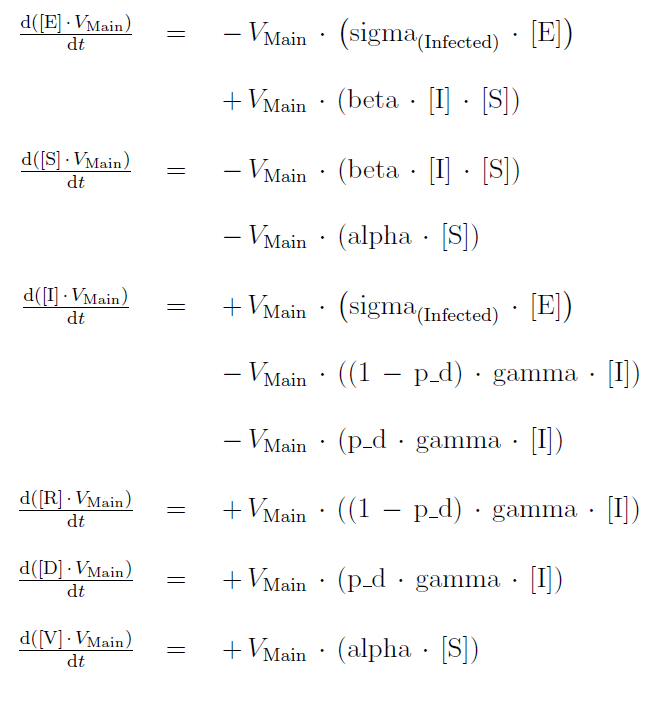

# covid19-model
📈 Examine the impact of COVID-19 spread by using a custom epidemiological model.

## Requirements

- [Copasi](http://copasi.org/)  
- [Jupyter](https://jupyter.org/) (or any notebook editor)

## Introduction

In early 2020, after a December 2019 outbreak in Wuhan-China, the World Health Organization identified SARS-CoV-2 as a new type of coronavirus. The outbreak quickly
spread around the world raising global awareness.

COVID-19 is a disease caused by SARS-CoV-2 that can trigger what medical experts call a respiratory tract infection. It can affect the upper respiratory tract (sinuses, nose, and throat) or lower respiratory tract (windpipe and lungs). It spreads the same way other coronaviruses do, mainly through person-to-person contact. Infections range from mild to deadly. SARS-CoV-2 is one of seven types of coronavirus, including the ones that cause severe diseases like Middle East respiratory syndrome (MERS) and sudden acute respiratory syndrome (SARS). The other coronaviruses cause most of the colds that affect us during the year but aren't a serious threat for otherwise healthy people. It is also normal for a virus to change, or mutate, as it infects people and this virus has done so. There are several variants which have been named for the regions they were first discovered but they have now spread to other areas and countries, some proving to be more contageous as well as more deadly.  

The goal of this project is examine the impact of COVID-19 spread by using a custom
epidemiological model. The model itself is an extended SEIR model comprising of six
compartments corresponding to discrete human groups: susceptible, exposed, infectious,
vaccined and recovered. The model parameters are initially calibrated according to the
study performed by Mwalili et al.[2] and then the estimated set of model state and pa-
rameters is used to assess the model prediction skill by investigating the initial COVID-19
spread in Greece.

## Methods

Simulation and modeling is becoming a standard approach to understand complex bio-
chemical processes. Therefore, there is a big need for software tools that allow access to
diverse simulation and modeling methods as well as support for the usage of these method.
COPASI is an open-source software application for creating and solving mathematical
models of biological processes such as metabolic networks, cell-signaling pathways, reg-
ulatory networks, infectious diseases, and many others. In this case, this software was
utilized as an epidemic simulator since the the biochemical reactions networks resemble
the viruses behaviour.

As an extra step, the same model without the vaccination part, was implemented in
python (*see [SIERD_model.ipynb](./src/SIERD_model.ipynb)*) for this project as well.

## Model

The basic SEIR model is expanded to six compartments to simulate the epidemic of
COVID-19. Six state variables are considered within a population, that is, S(t), E(t),
I(t), R(t), D(t), and V(t), denoting the number of susceptible, exposed (infected, but not
yet infectious), infectious (symptomatic and asymptomatic), recovered, dead, and vacci-
nated cases, respectively. Thus, the human population is denoted by N(t) = S(t)+E(t)+
I(t) + R(t) + D(t) + V (t).

## Differential equations

The model culminates to a six-dimensional system of ordinary differential equations as
follows.

## Model Parameters

The parameters used in the COVID-19 transmission model differentials equations are given
in the following table.

|Model parameter name   |Meaning	           |Case/Reference	 |
| --------------------- | ------------------ | --------------- | 
|alpha	                |Vaccination rate	   |0.04 per day [1] |
|beta	                  |Contact rate	       |ASSUMED	         |
|gamma                  |Mean recovery rate  |0.06 per day [2] |
|sigma	                |Incubation rate	   |0.09 [2]         |
|p_d	                  |Covid Fatality rate |0.0018 [2]       |

## Assumptions

Needless to say, a few assumptions were made, in order to accomodate the COPASI model
and provide basic but solid predictions. First of all, the human population is considered
constant involving no natural deaths and births. Travelling from region to region is also
not included in the general schema.  

Regarding the transmission, human are the only vessels of the virus so no other pathogenic
factors exist in the specifc context. Moreover, there are no reinfections for humans that
have already recovered or been vaccinated. Consequently, the latter gain full immunity
once they have been vaccinated. Also, it is worth stressing that the rate of successful
immunization by vaccination is not considered.  

Some effects like seasonal effects, natural deaths or births have not been considered in this
model, since their effect is not as crucial as the aforementioned. However, compartments
or parameters like quarantine and reinfections may enhance the overall model performance
and should be taken into consideration in future work.

## Copasi Guideline:

- Import *SIERD-V.cps* into COPASI

- To run the model for the initial parameters, go to 'Tasks>Time Course', create a plot by pressing the button 'Output Assistant' and hit 'Run'.

- To apply Sensitivity Analysis, head over to 'Tasks > Parameter Scan', press 'Create' and choose a global quantity. Then, you are ready to to apply sensitivity analysis by pressing 'Run'.

Change parameters to your liking

**Read the [full report](./Report.pdf) for details and results - discussion**

## References

[1] E. O.-O. Max Roser, Hannah Ritchie and J. Hasell. Coronavirus pandemic (covid-19).
Our World in Data, 2020. https://ourworldindata.org/coronavirus.  
[2] S. Mwalili, M. Kimathi, V. Ojiambo, D. Gathungu, and R. Mbogo. SEIR model
for COVID-19 dynamics incorporating the environment and social distancing. BMC
Research Notes, 13(1), July 2020.  
[3] W. C. Roda, M. B. Varughese, D. Han, and M. Y. Li. Why is it diffcult to accurately
predict the COVID-19 epidemic? Infectious Disease Modelling, 5:271{281, 2020.  
